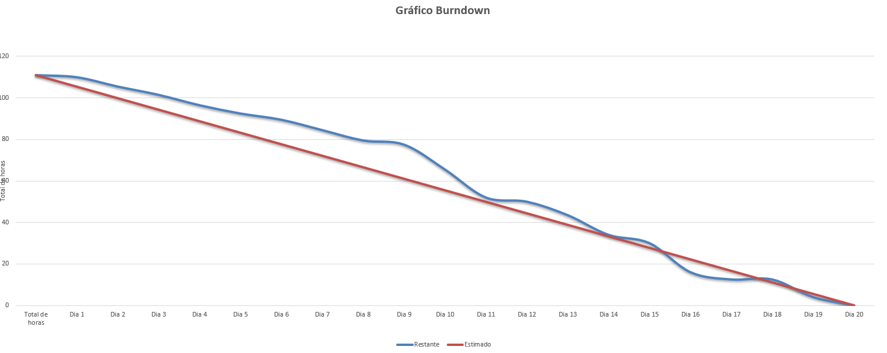

<h1 align="center">Sprint 2: 06/10/2025 - 26/10/2025</h1>

    <a href="#dor-dod">DoR e DoD</a> &nbsp; |&nbsp; &nbsp;
    <a href="#objetivos">Objetivos da Sprint</a> &nbsp; |&nbsp; &nbsp;
    <a href="#MVP">MVP</a> &nbsp; |&nbsp; &nbsp;
    <a href="#metricas">Métricas do Time</a>

 

Este relatório detalha as atividades realizadas durante a segunda sprint do projeto "Sistema de PDI (Plano de Desenvolvimento Individual)". O objetivo principal desta fase foi desenvolver o registro de objetivos, melhorar o gerenciamento geral dos dados, e desenvolver uma estilização mais sofisticada para o sistema.

 

## DoR Definition of Ready
**Clique no link abaixo para visualizar o DoR:**
> [Definition of Ready](https://docs.google.com/document/d/1JypgD6klpmaMFWAlN-XvFfIDdT5w3FigAVdgb19mErk/edit?usp=sharing)

 

## DoD Definition of Done
**Clique no link abaixo para visualizar o DoD:**
> [Definition of Done](https://docs.google.com/document/d/1XPf3VzQwvh62Na2uDACP2GVw0jecU-QrGtIdyGhpPGo/edit?usp=sharing)

 

## Objetivos da Sprint
O principal objetivo desta sprint foi entregar as funcionalidades básicas de administração de usuários e a capacidade de iniciar o registro de PDIs. Isso incluiu permitir que o RH cadastre, consulte, edite e inative usuários, crie novos PDIs associados a colaboradores e defina os objetivos e metas iniciais dentro desses planos. A base do banco de dados e a estrutura inicial da aplicação JavaFX foram implementadas para suportar essas funcionalidades.

 

### Backlog da Sprint

| ID    | Prioridade | User Story                                                                                                                              |
| :---- | :--------- | :-------------------------------------------------------------------------------------------------------------------------------------- |
| US-04 | ALTA       | Como RH ou Gestor de Área, quero avaliar as Hard Skills e Soft Skills de um colaborador dentro do seu PDI, para registrar suas competências.|
| US-05 | ALTA       | Como RH ou Gestor de Área, quero atualizar o status de atingimento dos objetivos de um PDI, para acompanhar o progresso do colaborador. |
| US-06 | BAIXA       | Como RH ou Gestor de Área, quero poder fazer o upload de documentos em um PDI específico, para centralizar as evidências de desenvolvimento.|

 

## MVP
[Vídeo de Apresentação do MVP da Sprint 1](https://youtu.be/JZE0d3_YgsM)

 

## Métricas da Equipe
*A equipe conseguiu entregar todas as funcionalidades previstas para a sprint atual e até adiantou algumas funcionalidades da próxima, estabelecendo a base para o desenvolvimento futuro.*

 

 

→ [Voltar ao topo](#topo)
