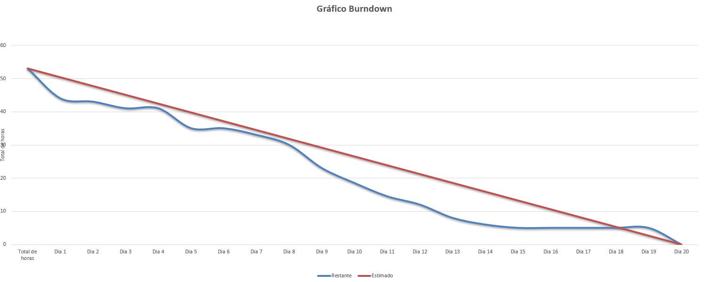

<h1 align="center">Sprint 3: 03/11/2025 - 23/11/2025</h1>

    <a href="#dor-dod">DoR e DoD</a> &nbsp; |&nbsp; &nbsp;
    <a href="#objetivos">Objetivos da Sprint</a> &nbsp; |&nbsp; &nbsp;
    <a href="#MVP">MVP</a> &nbsp; |&nbsp; &nbsp;
    <a href="#metricas">Métricas do Time</a>

 

Este relatório detalha as atividades realizadas durante a terceira sprint do projeto "Sistema de PDI (Plano de Desenvolvimento Individual)". O objetivo principal da Sprint 3 é fornecer recursos de visualização e exportação de dados consolidados, permitindo uma análise estratégica e macro do desempenho dos colaboradores.

 

## DoR Definition of Ready
**Clique no link abaixo para visualizar o DoR:**
> [Definition of Ready](https://docs.google.com/document/d/1JypgD6klpmaMFWAlN-XvFfIDdT5w3FigAVdgb19mErk/edit?usp=sharing)

 

## DoD Definition of Done
**Clique no link abaixo para visualizar o DoD:**
> [Definition of Done](https://docs.google.com/document/d/1XPf3VzQwvh62Na2uDACP2GVw0jecU-QrGtIdyGhpPGo/edit?usp=sharing)

 

## Objetivos da Sprint
Nessa sprint, o foco está em disponibilizar painéis gerenciais e relatórios que apresentem o atingimento coletivo de metas (US-07) e a exportação de informações dos PDIs (US-08), além de oferecer uma visão consolidada do progresso das equipes pelos gestores de área (US-09).

 

### Backlog da Sprint

| ID    | Prioridade | User Story                                                                                                                              |
| :---- | :--------- | :-------------------------------------------------------------------------------------------------------------------------------------- |
| US-07 | BAIXA       | Como Gestor Geral, quero visualizar um painel com o cálculo de atingimento de metas coletivo, para ter uma visão macro do desenvolvimento.|
| US-08 | BAIXA       | Como RH, quero poder exportar as informações de um PDI para uma planilha, para análises externas.|
| US-09 | BAIXA       | Como Gestor de Área, quero ter uma visualização consolidada do progresso dos PDIs de todos os meus liderados, para gerenciar minha equipe.|

 

## MVP
[Vídeo de Apresentação do MVP da Sprint 3](https://youtu.be/meaiycU6ehY)

 

## Métricas da Equipe
*A equipe conseguiu entregar todas as funcionalidades previstas para a projeto.*

 

 

→ [Voltar ao topo](#topo)
