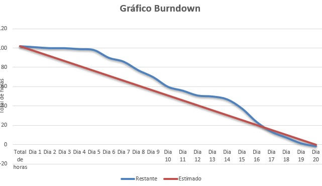

<h1 align="center">Sprint 1: 08/09/2025 - 28/09/2025</h1>

    <a href="#dor-dod">DoR e DoD</a> &nbsp; |&nbsp; &nbsp;
    <a href="#objetivos">Objetivos da Sprint</a> &nbsp; |&nbsp; &nbsp;
    <a href="#MVP">MVP</a> &nbsp; |&nbsp; &nbsp;
    <a href="#metricas">Métricas do Time</a>

 

Este relatório detalha as atividades realizadas durante a primeira sprint do projeto "Sistema de PDI (Plano de Desenvolvimento Individual)". O objetivo principal desta fase foi estabelecer a base da aplicação Java Desktop, focando nas funcionalidades essenciais de gerenciamento de usuários e na criação inicial da estrutura para os Planos de Desenvolvimento Individual (PDIs).

 

## DoR Definition of Ready
**Clique no link abaixo para visualizar o DoR da Sprint 01:**
> [Definition of Ready](https://docs.google.com/document/d/1JypgD6klpmaMFWAlN-XvFfIDdT5w3FigAVdgb19mErk/edit?usp=sharing)

 

## DoD Definition of Done
**Clique no link abaixo para visualizar o DoD da Sprint 01:**
> [Definition of Done](https://docs.google.com/document/d/1XPf3VzQwvh62Na2uDACP2GVw0jecU-QrGtIdyGhpPGo/edit?usp=sharing)

 

## Objetivos da Sprint
O principal objetivo desta sprint foi entregar as funcionalidades básicas de administração de usuários e a capacidade de iniciar o registro de PDIs. Isso incluiu permitir que o RH cadastre, consulte, edite e inative usuários, crie novos PDIs associados a colaboradores e defina os objetivos e metas iniciais dentro desses planos. A base do banco de dados e a estrutura inicial da aplicação JavaFX foram implementadas para suportar essas funcionalidades.

 

### Backlog da Sprint

| ID    | Prioridade | User Story                                                                                                                              |
| :---- | :--------- | :-------------------------------------------------------------------------------------------------------------------------------------- |
| US-01 | ALTA       | Como RH, quero cadastrar, consultar, editar e inativar usuários no sistema, para gerenciar quem tem acesso à plataforma.                  |
| US-02 | ALTA       | Como RH, quero criar um novo PDI para um colaborador, associando-o a um ano específico, para iniciar o registro histórico dos planos. |
| US-03 | ALTA       | Como RH ou Gestor de Área, quero definir objetivos e metas dentro de um PDI existente, para detalhar o que se espera do colaborador.    |

 

## MVP
[Vídeo de Apresentação do MVP da Sprint 1](https://youtu.be/JZE0d3_YgsM)

 

## Métricas da Equipe
*A equipe conseguiu entregar as funcionalidades planejadas para o cadastro de usuários e criação de PDIs, estabelecendo a base para as próximas sprints.*

 

 

→ [Voltar ao topo](#topo)