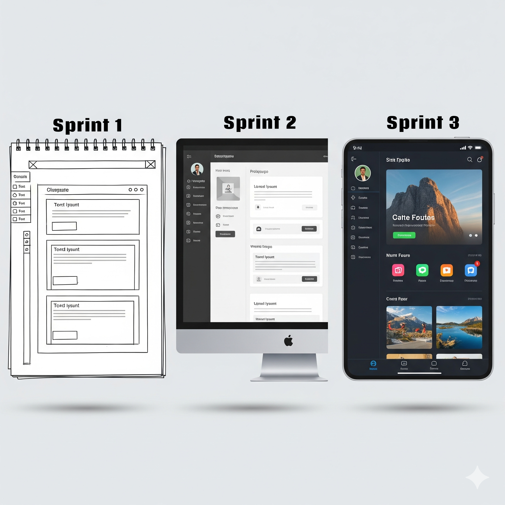

# Projeto API 2025-2 – Sistema de PDI (Plano de Desenvolvimento Individual)

## Índice

- [1. Descrição do Desafio](#1-descrição-do-desafio)
- [2. Backlog do Produto](#2-backlog-do-produto)
- [3. Cronograma de Evolução do Projeto](#3-cronograma-de-evolução-do-projeto)
- [4. Sprints](#4-sprints)
- [5. Tecnologias Utilizadas](#5-tecnologias-utilizadas)
- [6. Estrutura do Projeto](#6-estrutura-do-projeto)
- [7. Como Executar o Projeto](#7-como-executar-o-projeto)
- [8. Documentação](#8-documentação)
- [9. Equipe](#9-equipe)

---

## 1. Descrição do Desafio

### Parceiro

- **Empresa:** Youtan
- **Contato:** Fátima Marques Machado – [fatima.machado@youtan.com.br](mailto:fatima.machado@youtan.com.br)

### A Dor do Parceiro

O Plano de Desenvolvimento Individual (PDI) é uma ferramenta essencial para o crescimento dos colaboradores, resultando em maior retenção de talentos, engajamento e aprimoramento de competências. Atualmente, o departamento de RH da Youtan gerencia esses planos através de **planilhas avulsas**, o que gera dificuldades no controle, falta de histórico consolidado e dificuldade na geração de relatórios e métricas de desempenho.

O objetivo deste projeto é desenvolver uma aplicação **Java Desktop com Banco de Dados** para centralizar e otimizar a gestão de PDIs, resolvendo os problemas atuais e apoiando o desenvolvimento dos colaboradores de forma estratégica.

---

## 2. Backlog do Produto

| Rank | Prioridade | User Story                                                                                                                | Estimativa | Sprint |
| :--- | :--------- | :------------------------------------------------------------------------------------------------------------------------ | :--------- | :----- |
| 1    | Alta       | Como **RH**, quero cadastrar e gerenciar colaboradores para associá-los aos seus respectivos PDIs.                        | 8          | 1      |
| 2    | Alta       | Como **Gerente de Área**, quero criar um novo PDI anual para um colaborador da minha equipe, definindo metas e objetivos. | 13         | 1      |
| 3    | Alta       | Como **RH**, quero ter um painel para visualizar todos os PDIs em andamento na empresa.                                   | 8          | 2      |
| 4    | Alta       | Como **Gerente de Área**, quero poder fazer o upload de documentos (certificados, feedbacks) no PDI de um liderado.       | 5          | 2      |
| 5    | Média      | Como **Gerente Geral**, quero exportar um relatório em planilha com o percentual de atingimento de metas por área.        | 13         | 3      |
| 6    | Média      | Como **Gerente de Área**, quero visualizar o histórico de PDIs de anos anteriores de um colaborador.                      | 5          | 3      |
| 7    | Baixa      | Como **RH**, quero poder desativar o acesso de um colaborador que foi desligado da empresa.                               | 3          | 4      |

---

## 3. Cronograma de Evolução do Projeto



---

## 4. Sprints

| Fase               | Previsão                | Status    |
| -------------------- | ----------------------- | --------- |
| Kick Off Geral       | 25/08/2025 - 29/08/2025 | Concluído |
| Sprint 1                   | 08/09/2025 - 28/09/2025 | Em progresso |
| Sprint 2                   | 06/10/2025 - 26/10/2025 | A começar |
| Sprint 3                   | 03/11/2025 - 23/11/2025 | A começar |
| Feira de Soluções    | 29/05/2025              | A começar |
---

## 5. Tecnologias Utilizadas

- **Linguagem:** Java (Desktop com JavaFX)
- **Banco de Dados:** MySQL
- **Controle de Versão:** Git & GitHub
- **Ferramentas de Documentação:** User Stories, Wireframes, Diagramas (Classe e Entidade-Relacionamento)

---

## 6. Estrutura do Projeto

```/
├── src/
│ ├── main/
│ │ ├── java/
│ │ └── resources/
│ └── test/
├── docs/
├── database/
├── .gitignore
└── README.md
```

---

## 7. Como Executar o Projeto

### Pré-requisitos

- Java JDK 11 ou superior
- MySQL 8.0
- Apache Maven
- Git

### Instalação e Execução

1.  **Clone o repositório:**
    ```bash
    git clone https://github.com/Galaticos-API/API-2.git
    ```
2.  **Configure o banco de dados:**

    - Crie um banco de dados chamado `pdi_youtan`.
    - Execute o script `database/script.sql` para criar as tabelas.

3.  **Compile e execute o projeto**

---

## 8. Documentação

A documentação completa do projeto pode ser encontrada na pasta `/docs` do repositório ou através do link abaixo.

- **[Acessar Pasta de Documentação](./docs/)**

A pasta irá incluir:

- **Checklist de DoR (Definition of Ready) e DoD (Definition of Done)**
- **Detalhes de DoR e DoD por Sprint**
- **Estratégia de Branch (GitFlow)**
- **[Manual de Usuário](./docs/manual_usuario.md)**
- **[Manual de Instalação](./docs/manual_instalacao.md)**

---

## 9. Equipe

|           Nome            |     Função     |                                                                            GitHub                                                                             |                                                                                               Linkedin                                                                                               |
| :-----------------------: | :------------: | :-----------------------------------------------------------------------------------------------------------------------------------------------------------: | :--------------------------------------------------------------------------------------------------------------------------------------------------------------------------------------------------: |
|     Emmanuel Garakis      | Product Owner  |    <a href='https://github.com/Garakis'></a>     | <a href='https://www.linkedin.com/in/emmanuel-basile-garakis-filho-024572266/'></a> |
|      Rafael Matesco       |  Scrum Master  |  <a href='https://github.com/RafaMatesco'></a>   |         <a href='https://www.linkedin.com/in/rafael-giordano-matesco/'></a>         |
|        Caio César         | Team Developer |    <a href='https://github.com/JkDeltaz'></a>    |    <a href='https://www.linkedin.com/in/caio-c%C3%A9sar-santos-79976636a/'></a>     |
|        Daniel Dias        | Team Developer | <a href='https://github.com/DanielDPereira'></a> |      <a href='https://www.linkedin.com/in/daniel-dias-pereira-40219425b/'></a>      |
| Gabriel dos Santos Lasaro | Team Developer |   <a href='https://github.com/Sashxjssx'></a>    |        <a href='https://www.linkedin.com/in/gabriel-lasaro-527827352/'></a>         |
|     Giovanni Moretto      | Team Developer |  <a href='https://github.com/Darkghostly'></a>   |    <a href='https://www.linkedin.com/in/gustavo-bueno-da-silva-797292324/'></a>     |
|       Gustavo Bueno       | Team Developer |  <a href='https://github.com/Darkghostly'></a>   |    <a href='https://www.linkedin.com/in/gustavo-bueno-da-silva-797292324/'></a>     |
|  Gustavo Monteiro Greco   | Team Developer | <a href='https://github.com/GustavoMGreco'></a>  |              <a href='https://www.linkedin.com/in/gustavomgreco/'></a>              |
